# AI 测试用例生成与测试辅助平台

> 基于 **RAG + LLM** 的 AI 测试用例生成与测试辅助平台，帮助测试工程师完成需求分析、测试点梳理、测试用例生成和产品知识检索。
>
> **AI Test Case Generator · AI Testing · RAG · LLM · Software Testing**

[简体中文](README.md) | [English](README_EN.md)

[](https://github.com/ChiufungLee/RAG_TestCases_Generator/stargazers)
[](https://github.com/ChiufungLee/RAG_TestCases_Generator/network/members)
[](https://github.com/ChiufungLee/RAG_TestCases_Generator/issues)
[](LICENSE)

<!--
Demo GIF 推荐放置：
docs/images/demo.gif

建议演示流程：
上传 PDF → 选择知识库 → 需求澄清 → 创建测试任务 → 人工确认 → 用例生成 → 覆盖检查 → 导出 CSV

素材就绪后取消下一行注释即可启用：

-->

---

## 📌 项目简介

AI 测试用例生成与测试辅助平台是一个面向 **软件测试、测试开发和 AI 辅助测试** 场景的开源项目。

系统基于 **FastAPI + LangChain + LangGraph + RAG + ChromaDB + LLM** 构建，支持上传 PDF 产品/需求文档，将文档转换为可检索的知识库，并结合大语言模型完成：

- 场景化对话：需求澄清、产品指南、运维助手，结合知识库检索回答
- 结构化测试工作流：需求分析 → 人工确认 → 测试用例生成 → 覆盖检查（LangGraph 编排，产物按版本落库）
- 测试用例导出 CSV
- PDF 文档上传、预览与删除
- 多用户会话与知识库隔离

项目希望解决测试工程师在需求理解、产品知识检索和测试用例设计过程中大量重复的分析与整理工作。

---

## ✨ 核心能力

| 能力 | 说明 |
| --- | --- |
| 📄 PDF 知识库 | 上传产品文档、需求文档等 PDF，后台解析并向量化，建立可检索知识库 |
| 🔎 RAG 检索 | 根据用户问题检索相关文档内容注入上下文；多轮追问先做 query rewrite，历史消息按条数 + token 预算双重裁剪 |
| 💬 场景化聊天 | 需求澄清 / 产品指南 / 运维助手三个场景，选中知识库走 RAG，未选知识库自动切换纯对话提示词 |
| 📎 聊天附件 | 对话时可直接附带 PDF：知识库对话后台入库参与检索，普通对话直接解析文档内容作为上下文 |
| 🧩 结构化测试工作流 | LangGraph 编排：需求分析 → 人工确认 → 用例生成 → 覆盖检查，各阶段产物以 Artifact 按版本落库 |
| 🖱️ 人工确认（Human-in-the-loop） | 需求分析完成后暂停，可编辑分析结果后继续；状态由 SQLite checkpointer 持久化，断连后可恢复 |
| ✅ 覆盖检查 | 不经 LLM：基于需求引用的集合运算 + RapidFuzz 字符相似度查重，统计口径透明 |
| 🧰 测试工作台 | 用例集资产长期管理：工作流用例一键发布为资产，支持人工编辑、追加式版本管理、字段级版本对比、一键回滚与私有/共享可见性 |
| 🤖 AI 修改用例 | 自然语言指令修改已发布用例集：AI 输出完整提案，diff 确认后落「AI 修改」版本；用例编号不可变，删除由服务端显式推导 |
| 🔌 API 测试工作台 | 导入 OpenAPI/Swagger 文档：确定性 Schema 规则引擎生成接口用例（正常/缺失必填/类型错误/越界/非法枚举/违反格式）+ AI 业务异常建议（两段式确认）+ 进程内 httpx 顺序执行，SSE 实时结果 |
| 🔌 API 测试工作台 | OpenAPI/Swagger 导入 → Schema 规则引擎确定性生成接口用例（正常/缺失必填/类型错误/越界/非法枚举）→ AI 补充业务异常 → 进程内 httpx 执行，SSE 实时结果与三态判定（通过/失败/异常） |
| 📚 产品知识助手 | 基于产品文档回答使用和排障相关问题 |
| 👤 多用户隔离 | 会话与知识库按用户进行隔离 |
| 👥 共享知识库 | 知识库支持私有/共享两种可见性，共享知识库对所有登录用户可读 |
| ⚡ 流式响应 | LLM 输出采用流式方式返回；支持 DeepSeek 思考模式开关 |
| 📤 用例导出 | 测试任务生成的用例可一键导出 CSV（`utf-8-sig` 带 BOM，Excel 直接打开不乱码） |

---

## 🔄 当前工作流程

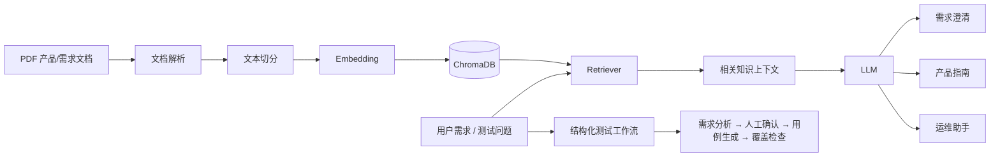

---

## 🧩 结构化测试工作流（LangGraph）

除场景化聊天外，系统还提供一条由 **LangGraph** 编排的真实测试工作流（入口：侧栏「测试工作流」或 `/workflows`）：

```text
START
  ↓
load_requirement          # 确定性节点：读取需求与知识库配置
  ↓
retrieve_knowledge        # 确定性节点：按需求文本做一次 RAG 检索，结果落库供回看
  ↓
requirement_analysis_agent  # Agent 节点：结构化输出需求分析（JSON）
  ↓
human_review              # interrupt：人工确认 / 编辑分析结果后继续
  ↓
test_case_generation_agent  # Agent 节点：消费上游分析结果生成用例（不再重新理解需求）
  ↓
coverage_check            # 确定性节点：需求覆盖 / 非法引用 / 优先级分布 / 重复用例检测
  ↓
END
```

- **Artifact 作为一等对象**：需求分析、用例集、覆盖报告均落库（`workflows` + `artifacts` 表），按版本追加，人工修订会生成新版 Artifact（`parent_artifact_id` 指向旧版），实现"用例基于哪版分析"的追溯。
- **Human-in-the-loop**：需求分析完成后图在 `human_review` 节点 `interrupt` 暂停，前端可编辑分析 JSON 后确认继续；状态由 SQLite checkpointer 持久化，断连后可从断点恢复。
- **确定性检查不经过 LLM**：覆盖检查由集合运算与字符相似度（RapidFuzz）完成，杜绝"LLM 自评覆盖率"的噪声；报告附带统计口径说明。
- **动态用例上限**：生成数量按需求点数量自动计算（`clamp(需求点数 × 3, 10, 40)`），避免小需求产出海量用例或大需求被截断。

---

## 🖼️ 界面预览

| 需求澄清（RAG 检索 + 来源标注） | 测试工作流（人工确认分析结果） |
| --- | --- |
| 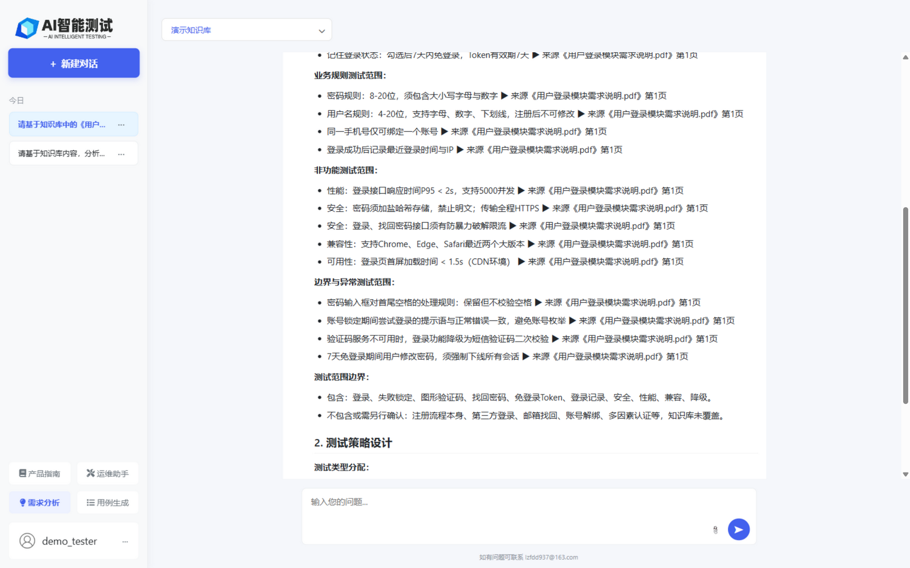 | 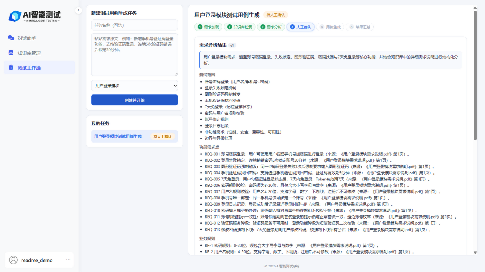 |

| 测试用例生成（可一键导出 CSV） | 覆盖检查报告 |
| --- | --- |
| 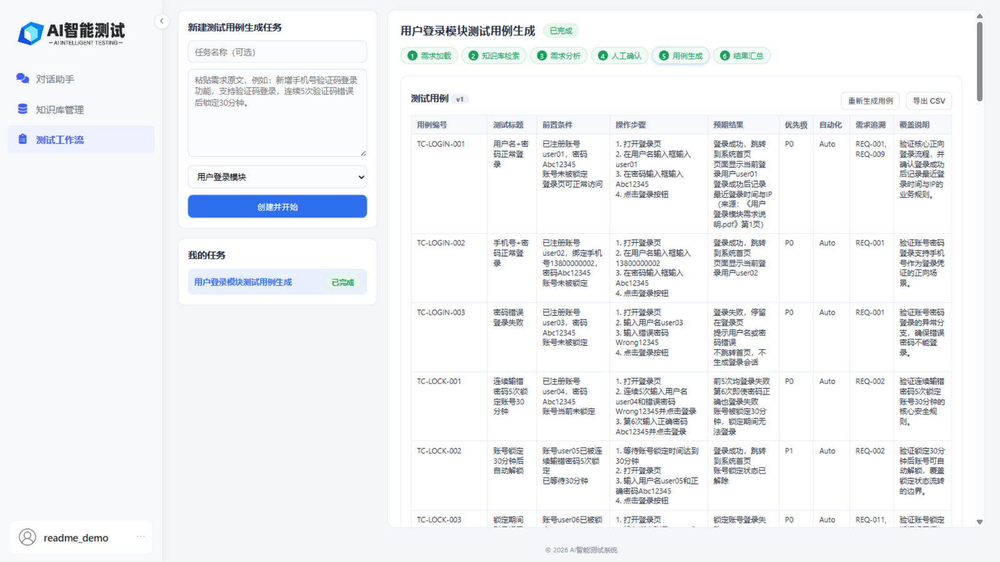 | 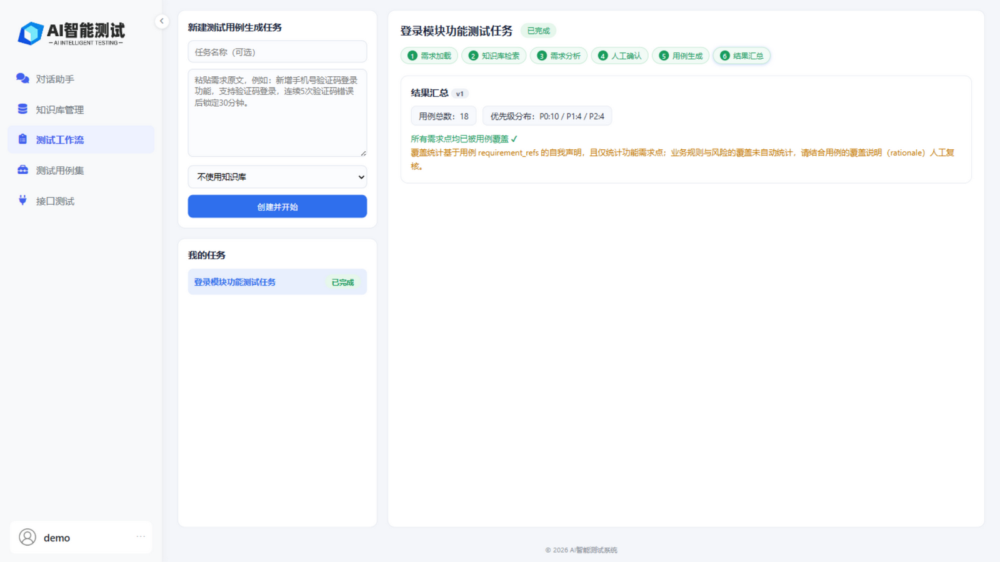 |

| 知识库文档管理 | 聊天附件（普通对话直读 PDF） |
| --- | --- |
| 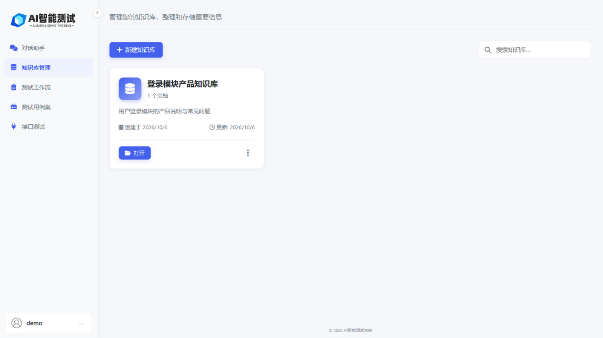 | 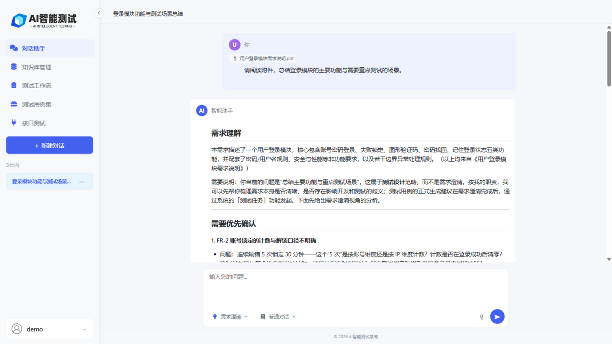 |

| API 测试工作台（导入 / 用例生成 / 执行） | |
| --- | --- |
| 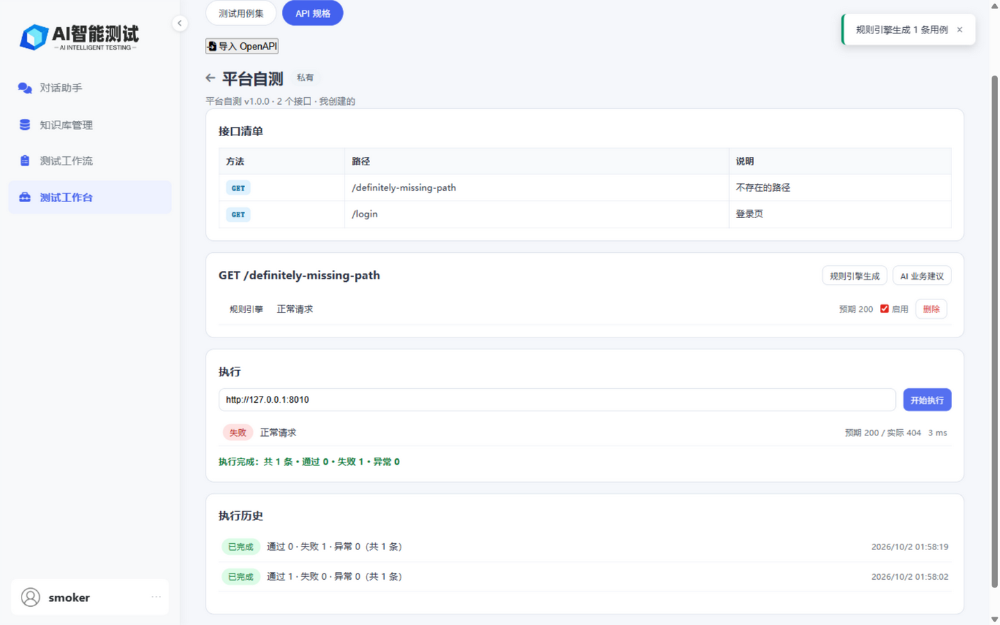 | |

| 测试工作台（用例集资产） | 用例集详情（编辑 / 版本 / 回滚） | 字段级版本对比 |
| --- | --- | --- |
| 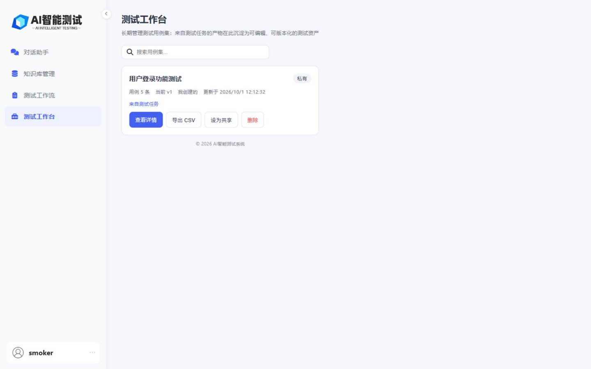 | 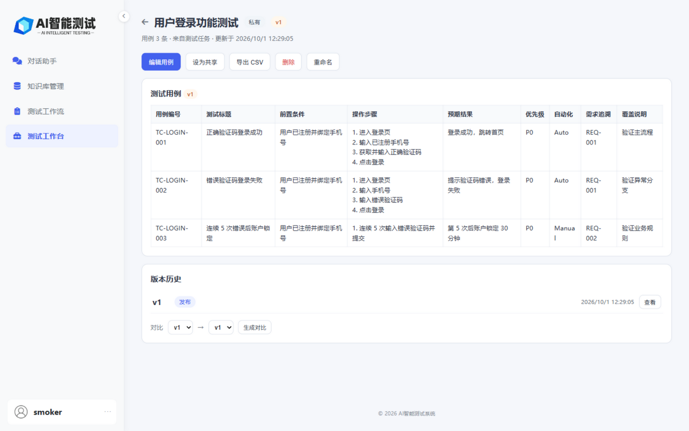 | 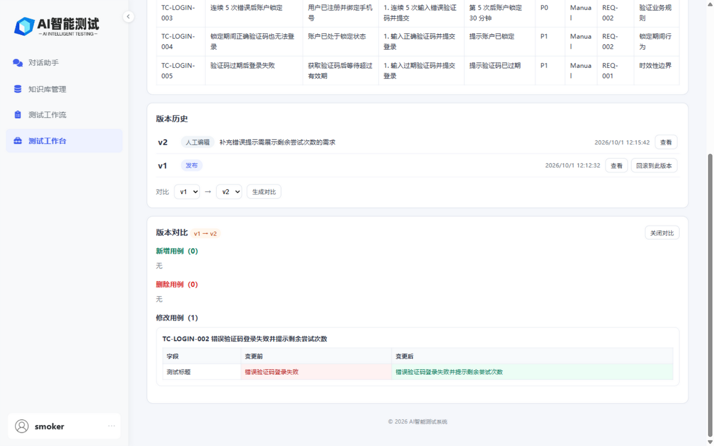 |

---

## 🔍 关键词

中文：AI 测试 · AI 测试用例生成 · 需求分析 · 软件测试 · 测试提效

English: AI Testing · AI Test Case Generation · Software Testing · Test Automation · RAG

---

## 🧰 技术栈

### Backend

- Python 3.11+（建议 3.12）
- FastAPI
- SQLAlchemy

### AI / RAG

- LangChain
- LangGraph
- ChromaDB
- Retrieval-Augmented Generation (RAG)
- Large Language Model (LLM)
- Embedding

### Frontend

- HTML
- JavaScript

### Database

- MySQL
- SQLite（测试环境）

---

## 🤖 当前模型配置

模型通过独立的 `LLM_*` 和 `EMBEDDING_*` 配置进行管理。

当前仓库示例配置使用：

- **LLM**：DeepSeek `deepseek-v4-flash`
- **Embedding**：阿里百炼 `text-embedding-v4`

> 文档入库与查询检索必须使用兼容的 Embedding 模型和向量维度。修改 `EMBEDDING_MODEL` 或 `EMBEDDING_DIMENSIONS` 后，应评估并按需重建已有 Chroma 向量集合。

LLM 与 Embedding 的 API 凭证、地址和模型参数彼此独立。

> DeepSeek 思考模式默认关闭（`LLM_ENABLE_THINKING=false`），此时响应更快且 temperature 正常生效；开启后 reasoning token 计入 `max_tokens` 且 temperature 不生效，需要相应调大 `LLM_MAX_TOKENS` / `WORKFLOW_LLM_MAX_TOKENS`。

---

## 🚀 本地运行

### 环境要求

准备：

- Python 3.11+（建议 3.12；LangGraph 的人工确认节点在 3.10 上无法正常运行）
- MySQL 或 SQLite
- 可调用的 LLM API
- 可调用的 Embedding API

### 1. 克隆项目

```bash
git clone https://github.com/ChiufungLee/RAG_TestCases_Generator.git
cd RAG_TestCases_Generator
```

### 2. 安装依赖

```bash
pip install -r requirements.txt
```

### 3. 配置环境变量

复制根目录的 `.env.example` 为 `.env`，按需修改。关键配置项：

```env
# 应用环境
APP_ENV=development
SESSION_SECRET_KEY=dev-session-secret-change-me

# 数据库（设置 DATABASE_URL 时优先生效，如 sqlite:///./fast_test.db；留空时用 MySQL 配置拼装）
# DATABASE_URL=
MYSQL_USER=root
MYSQL_PASSWORD=your_password
MYSQL_HOST=localhost
MYSQL_PORT=3306
MYSQL_DATABASE=aitest_rag

# LLM（DeepSeek）
LLM_PROVIDER=deepseek
LLM_MODEL=deepseek-v4-flash
LLM_API_KEY=your_llm_api_key
LLM_BASE_URL=https://api.deepseek.com
LLM_TEMPERATURE=0.7
LLM_MAX_TOKENS=16384
LLM_ENABLE_THINKING=false

# Embedding（阿里云百炼兼容接口）
EMBEDDING_PROVIDER=openai
EMBEDDING_MODEL=text-embedding-v4
EMBEDDING_API_KEY=your_embedding_api_key
EMBEDDING_BASE_URL=https://dashscope.aliyuncs.com/compatible-mode/v1
EMBEDDING_DIMENSIONS=1024
EMBEDDING_ENCODING_FORMAT=float

# 检索
RETRIEVER_TOP_K=5
RETRIEVER_CANDIDATE_K=10
CHROMA_DISTANCE_METRIC=cosine

# 工作流
WORKFLOW_LLM_MAX_TOKENS=16384
WORKFLOW_CHECKPOINT_DB_PATH=./data/langgraph_checkpoints.db

# 存储路径
RAG_DB_PATH=./chroma_db
UPLOAD_DIR=./uploads
TEMP_UPLOAD_DIR=./temp_uploads
```

### 配置说明

- 全量配置项及默认值见 [.env.example](.env.example)。
- 开发环境下，如果未设置 `DATABASE_URL`，应用会回退到 MySQL 配置拼接连接串。
- 生产环境必须显式配置 `SESSION_SECRET_KEY`，且数据库不得使用默认密码。
- `LLM_MAX_TOKENS` 控制 LLM 最大输出 token 数；`LLM_TIMEOUT_*` 单位为秒；`LLM_MAX_RETRIES` 控制请求重试次数。
- `LLM_ENABLE_THINKING=false`（默认）为非思考模式；`true` 时 reasoning token 计入 `max_tokens` 且 temperature 不生效。
- `EMBEDDING_DIMENSIONS` 必须与已有 Chroma 集合中的向量维度一致。
- `CHROMA_DISTANCE_METRIC`（cosine / l2）仅在集合创建时生效，对已存在集合不生效。
- 只有在 `RETRIEVER_ENABLE_DISTANCE_FILTER=true` 并设置 `RETRIEVER_DISTANCE_THRESHOLD` 时，才会启用距离阈值过滤；阈值含义依赖集合度量。
- `WORKFLOW_LLM_MAX_TOKENS` 为工作流结构化输出的 token 上限，需容纳完整用例集 JSON。

### 4. 启动应用

```bash
uvicorn main:app --host 0.0.0.0 --port 8000 --reload
```

### 5. 访问页面

- 对话助手：`http://localhost:8000/chat`
- 测试工作流：`http://localhost:8000/workflows`
- 测试工作台：`http://localhost:8000/testbench`
- 知识库管理：`http://localhost:8000/knowledge`
- Swagger UI：`http://localhost:8000/docs`
- ReDoc：`http://localhost:8000/redoc`

---

## 🧪 测试

项目使用 pytest 编写自动化测试（当前 235 个用例全部通过），覆盖用户认证与权限隔离、知识库文件链路、聊天附件、RAG 检索鉴权、工作流状态机与 Artifact 版本、SSE 事件流、测试用例集资产的发布/编辑/版本/回滚/AI 修改等关键路径。

运行全部测试：

```bash
pytest
```

运行单个测试文件或用例：

```bash
pytest tests/test_auth.py
pytest tests/test_chat_attachment.py
pytest tests/test_chat_authorization.py -k "test_user_cannot_read"
```

> 测试基于临时 SQLite 数据库运行，并通过桩实现隔离 LLM、Embedding 与 ChromaDB 等外部依赖，无需真实 API Key 即可执行。CI 集成将在后续版本补充。

---

## 🔌 主要路由

### 页面路由

```text
/login
/register
/chat
/knowledge
/knowledge-detail?kb_id=...
/workflows
/testbench
/testbench-detail?set_id=...
```

### 主要 API

```text
/api/chat                    # SSE 流式对话
/api/history
/api/conversation/...
/api/export/testcases        # 聊天用例导出 CSV
/api/knowledge-bases/...
/api/files/{file_id}/preview
/api/workflows/...           # 测试任务创建/运行事件/人工确认/CSV 导出
/api/test-sets/...           # 测试用例集：发布/编辑/版本/对比/回滚/导出
/api/api-specs/...           # API 规格：导入/接口/用例（规则引擎+AI）/执行（SSE）
/api/test-runs/{run_id}      # 测试执行详情与逐条结果
/api/api-specs/...           # API 规格：导入/接口/用例生成/执行（SSE）
/api/test-runs/{id}          # 测试执行记录与逐条结果
/logout
```

完整 API 可通过 Swagger 查看：

```text
http://localhost:8000/docs
```

---

## 📁 项目结构

```text
RAG_TestCases_Generator/
├── api/
│   └── endpoints/
├── models/
├── prompts/
├── schemas/
├── services/
├── static/
├── templates/
├── tests/
├── utils/
├── workflows/          # LangGraph 工作流编排（state / nodes / graph）
├── config.py
├── main.py
├── .env.example
├── requirements.txt
└── README.md
```

---

## 🧩 当前功能与后续规划

### 已实现

- [x] PDF 知识库
- [x] RAG 检索（多轮追问 query rewrite、历史裁剪）
- [x] 场景化聊天（需求澄清 / 产品指南 / 运维助手）
- [x] 聊天附件上传（知识库入库 / 普通对话直读）
- [x] 结构化需求分析
- [x] 测试工作流（需求分析 → 人工确认 → 用例生成 → 覆盖检查）
- [x] 测试工作台（用例集资产：发布 / 人工编辑 / 版本管理 / 对比 / 回滚 / 共享）
- [x] AI 修改用例（指令 → 结构化提案 → diff 确认 → 版本落库）
- [x] API 测试工作台（OpenAPI 导入 → 规则引擎/AI 生成用例 → httpx 执行 → SSE 实时结果与执行历史）
- [x] API 测试工作台（OpenAPI 导入 → 规则引擎/AI 生成 → httpx 执行 → 实时结果）
- [x] 人工确认 / 分析结果编辑
- [x] 测试用例 Artifact 与版本管理
- [x] 确定性覆盖检查
- [x] 用户会话
- [x] 知识库隔离
- [x] 共享知识库
- [x] 流式输出
- [x] CSV 用例导出

### Roadmap

#### v0.2 — 检索质量

- [ ] RAG 检索效果评估

#### v0.3 — Test Automation

- [ ] OpenAPI / Swagger 导入
- [ ] API 测试用例生成
- [ ] Pytest 测试脚本生成
- [ ] 自动化测试执行
- [ ] 测试结果持久化

#### v0.4 — AI Quality Engineering

- [ ] AI 测试结果分析
- [ ] 缺陷辅助分析
- [ ] 回归评估
- [ ] Quality Gate
- [ ] AI/LLM 输出质量评测

#### Long-term

```text
Requirement
    ↓
Requirement Analysis
    ↓
Risk Analysis
    ↓
Test Design
    ↓
Test Case Set
    ↓
Automation Script
    ↓
Test Execution
    ↓
Test Result
    ↓
AI Result Analysis
    ↓
Quality Evaluation / Quality Gate
```

---

## 🧠 为什么采用 RAG

单纯让 LLM 根据通用知识生成测试用例，容易忽略项目自身的业务规则、产品限制和历史文档。

本项目通过 RAG 将企业/产品文档纳入上下文，这样生成结果可以基于项目知识，而不是只依赖模型的通用知识。

---

## 🤝 贡献

欢迎提交：

- Issue
- Feature Request
- Pull Request
- 测试场景
- RAG 优化建议
- Prompt 优化建议

建议在提交 PR 前先说明问题背景、修改内容和验证方式。

---

## 📄 License

本项目基于 [MIT License](LICENSE) 开源。
