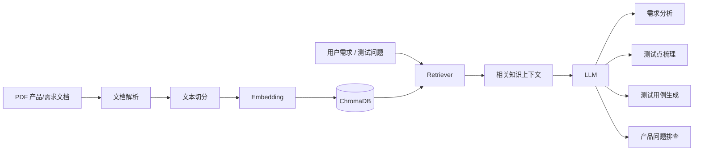

# AI 测试用例生成与测试辅助平台

> 基于 **RAG + LLM** 的 AI 测试用例生成与测试辅助平台，帮助测试工程师完成需求分析、测试点梳理、测试用例生成和产品知识检索。
>
> **AI Test Case Generator · AI Testing · RAG · LLM · Software Testing**

[简体中文](README.md) | [English](README_EN.md)

[](https://github.com/ChiufungLee/RAG_TestCases_Generator/stargazers)
[](https://github.com/ChiufungLee/RAG_TestCases_Generator/network/members)
[](https://github.com/ChiufungLee/RAG_TestCases_Generator/issues)
[](LICENSE)

<!--
Demo GIF 推荐放置：
docs/images/demo.gif

建议演示流程：
上传 PDF → 选择知识库 → 输入需求 → 需求分析 → 测试用例生成 → 导出结果

素材就绪后取消下一行注释即可启用：

-->

---

## 📌 项目简介

AI 测试用例生成与测试辅助平台是一个面向 **软件测试、测试开发和 AI 辅助测试** 场景的开源项目。

系统基于 **FastAPI + LangChain + RAG + ChromaDB + LLM** 构建，支持上传 PDF 产品/需求文档，将文档转换为可检索的知识库，并结合大语言模型完成：

- 需求分析与测试策略设计
- 测试点梳理
- 基于知识库的测试用例生成
- 产品问题排查与用户手册阅读
- PDF 文档上传、预览与删除
- 多用户会话与知识库隔离

项目希望解决测试工程师在需求理解、产品知识检索和测试用例设计过程中大量重复的分析与整理工作。

---

## ✨ 核心能力

| 能力 | 说明 |
| --- | --- |
| 📄 PDF 知识库 | 上传产品文档、需求文档等 PDF，并建立可检索知识库 |
| 🔎 RAG 检索 | 根据用户问题检索相关文档内容，为 LLM 提供上下文 |
| 💬 聊天附件 | 对话时可直接附带 PDF：知识库对话自动入库并参与检索，普通对话直接解析文档内容作为上下文 |
| 🧠 需求分析 | 对需求进行理解、测试范围分析、风险识别和验收标准梳理 |
| 🧪 测试用例生成 | 结合需求和知识库内容生成结构化测试用例 |
| 📚 产品知识助手 | 基于产品文档回答使用和排障相关问题 |
| 👤 多用户隔离 | 会话与知识库按用户进行隔离 |
| 👥 共享知识库 | 知识库支持私有/共享两种可见性，共享知识库对所有登录用户可读 |
| ⚡ 流式响应 | LLM 输出采用流式方式返回，改善交互体验 |
| 📤 用例导出 | 支持将生成的测试用例导出为 CSV |

---

## 🔄 当前工作流程



---

## 🔍 关键词

中文：AI 测试 · AI 测试用例生成 · 需求分析 · 软件测试 · 测试提效

English: AI Testing · AI Test Case Generation · Software Testing · Test Automation · RAG

---

## 🧰 技术栈

### Backend

- Python
- FastAPI
- SQLAlchemy

### AI / RAG

- LangChain
- ChromaDB
- Retrieval-Augmented Generation (RAG)
- Large Language Model (LLM)
- Embedding

### Frontend

- HTML
- JavaScript

### Database

- MySQL
- SQLite（测试环境）

---

## 🤖 当前模型配置

模型通过独立的 `LLM_*` 和 `EMBEDDING_*` 配置进行管理。

当前仓库示例配置使用：

- **LLM**：DeepSeek `deepseek-v4-flash`
- **Embedding**：阿里百炼 `text-embedding-v4`

> 文档入库与查询检索必须使用兼容的 Embedding 模型和向量维度。修改 `EMBEDDING_MODEL` 或 `EMBEDDING_DIMENSIONS` 后，应评估并按需重建已有 Chroma 向量集合。

LLM 与 Embedding 的 API 凭证、地址和模型参数彼此独立。

---

## 🚀 本地运行

### 环境要求

准备：

- Python 3.10+（建议 3.12）
- MySQL 或 SQLite
- 可调用的 LLM API
- 可调用的 Embedding API

### 1. 克隆项目

```bash
git clone https://github.com/ChiufungLee/RAG_TestCases_Generator.git
cd RAG_TestCases_Generator
```

### 2. 安装依赖

```bash
pip install -r requirements.txt
```

### 3. 配置环境变量

在项目根目录创建 `.env` 文件。

```env
# 应用环境
APP_ENV=development
SESSION_SECRET_KEY=dev-session-secret-change-me

# 数据库（二选一）
DATABASE_URL=
MYSQL_USER=root
MYSQL_PASSWORD=your_password
MYSQL_HOST=localhost
MYSQL_PORT=3306
MYSQL_DATABASE=aitest_rag

# LLM
LLM_PROVIDER=deepseek
LLM_MODEL=deepseek-v4-flash
LLM_API_KEY=your_llm_api_key
LLM_BASE_URL=https://api.deepseek.com
LLM_TEMPERATURE=0.7
LLM_MAX_TOKENS=4096
LLM_TIMEOUT_CONNECT=10
LLM_TIMEOUT_READ=120
LLM_TIMEOUT_WRITE=30
LLM_TIMEOUT_POOL=10
LLM_MAX_RETRIES=2

# Embedding
EMBEDDING_PROVIDER=openai
EMBEDDING_MODEL=text-embedding-v4
EMBEDDING_API_KEY=your_embedding_api_key
EMBEDDING_BASE_URL=https://dashscope.aliyuncs.com/compatible-mode/v1
EMBEDDING_DIMENSIONS=1024
EMBEDDING_ENCODING_FORMAT=float

# Chroma
CHROMA_DISTANCE_METRIC=l2

# Retriever
RETRIEVER_TOP_K=5
RETRIEVER_CANDIDATE_K=10
RETRIEVER_ENABLE_DISTANCE_FILTER=false
RETRIEVER_DISTANCE_THRESHOLD=

# Storage
RAG_DB_PATH=./chroma_db/local_rag_db
UPLOAD_DIR=./uploads
TEMP_UPLOAD_DIR=./temp_uploads
```

### 配置说明

- 开发环境下，如果未设置 `DATABASE_URL`，应用会回退到 MySQL 配置拼接连接串。
- 生产环境必须显式配置 `SESSION_SECRET_KEY`。
- 生产环境如果未设置 `DATABASE_URL`，请使用实际数据库密码，不要保留示例值。
- `LLM_MAX_TOKENS` 控制 LLM 最大输出 token 数。
- `LLM_TIMEOUT_*` 的单位为秒。
- `LLM_MAX_RETRIES` 控制 LLM 请求重试次数。
- `EMBEDDING_DIMENSIONS` 必须与已有 Chroma 集合中的向量维度一致。
- `RETRIEVER_TOP_K` 表示最终返回的文档数量。
- `RETRIEVER_CANDIDATE_K` 表示初始召回数量。
- 只有在 `RETRIEVER_ENABLE_DISTANCE_FILTER=true` 并设置 `RETRIEVER_DISTANCE_THRESHOLD` 时，才会启用距离阈值过滤。

### 4. 启动应用

```bash
uvicorn main:app --host 0.0.0.0 --port 8000 --reload
```

### 5. 访问页面

- 首页：`http://localhost:8000/`
- 聊天页：`http://localhost:8000/chat`
- 知识库管理：`http://localhost:8000/knowledge`
- Swagger UI：`http://localhost:8000/docs`
- ReDoc：`http://localhost:8000/redoc`

---

## 🧪 测试

自动化测试是项目后续工程化建设的重要组成部分。当前版本重点覆盖核心业务能力与 RAG 流程，测试套件与 CI 将随着项目持续完善。

计划覆盖的测试方向包括：

- 用户认证与权限隔离
- 知识库文件处理链路
- RAG 检索
- LLM 流式响应
- 后台任务处理
- API 接口

> 待测试套件正式提交并通过 CI 后，将在本节补充可直接复制执行的 pytest 命令与 CI 状态。

---

## 🔌 主要路由

### 页面路由

```text
/login
/register
/chat
/knowledge
/knowledge-detail?kb_id=...
```

### 主要 API

```text
/api/chat
/api/history
/api/conversation/...
/api/knowledge-bases/...
/api/files/{file_id}/preview
/logout
```

完整 API 可通过 Swagger 查看：

```text
http://localhost:8000/docs
```

---

## 📁 项目结构

```text
RAG_TestCases_Generator/
├── api/
│   └── endpoints/
├── models/
├── prompts/
├── schemas/
├── services/
├── static/
├── templates/
├── utils/
├── config.py
├── main.py
├── requirements.txt
└── README.md
```

---

## 🧩 当前功能与后续规划

### 已实现

- [x] PDF 知识库
- [x] RAG 检索
- [x] 聊天附件上传（知识库入库 / 普通对话直读）
- [x] 需求分析
- [x] 测试策略设计
- [x] 测试点梳理
- [x] AI 测试用例生成
- [x] 产品问题排查
- [x] 用户会话
- [x] 知识库隔离
- [x] 共享知识库
- [x] 流式输出
- [x] CSV 用例导出

### Roadmap

#### v0.2 — Structured Testing Workflow

- [ ] 结构化 Requirement Analysis
- [ ] Requirement → Test Case Workflow
- [ ] 测试用例 Artifact
- [ ] 测试用例版本管理
- [ ] RAG 检索效果评估

#### v0.3 — Test Automation

- [ ] OpenAPI / Swagger 导入
- [ ] API 测试用例生成
- [ ] Pytest 测试脚本生成
- [ ] 自动化测试执行
- [ ] 测试结果持久化

#### v0.4 — AI Quality Engineering

- [ ] AI 测试结果分析
- [ ] 缺陷辅助分析
- [ ] 回归评估
- [ ] Quality Gate
- [ ] AI/LLM 输出质量评测

#### Long-term

```text
Requirement
    ↓
Requirement Analysis
    ↓
Risk Analysis
    ↓
Test Design
    ↓
Test Case Set
    ↓
Automation Script
    ↓
Test Execution
    ↓
Test Result
    ↓
AI Result Analysis
    ↓
Quality Evaluation / Quality Gate
```

---

## 🧠 为什么采用 RAG

单纯让 LLM 根据通用知识生成测试用例，容易忽略项目自身的业务规则、产品限制和历史文档。

本项目通过 RAG 将企业/产品文档纳入上下文，这样生成结果可以基于项目知识，而不是只依赖模型的通用知识。

---

## 🤝 贡献

欢迎提交：

- Issue
- Feature Request
- Pull Request
- 测试场景
- RAG 优化建议
- Prompt 优化建议

建议在提交 PR 前先说明问题背景、修改内容和验证方式。

---

## 📄 License

本项目基于 [MIT License](LICENSE) 开源。
