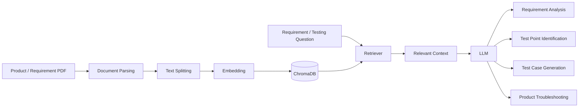
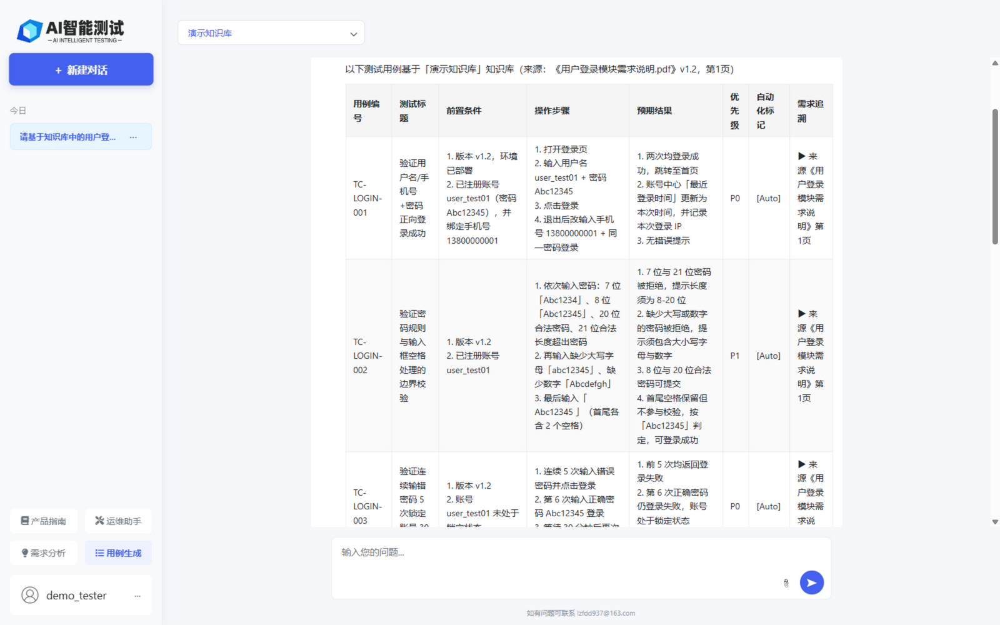

# AI Test Case Generation & Testing Assistant Platform

> An AI-powered testing assistant built with **RAG + LLM** to help software testers analyze requirements, identify test points, generate test cases, and retrieve product knowledge.
>
> **AI Test Case Generator · AI Testing · RAG · LLM · Software Testing**

[简体中文](README.md) | [English](README_EN.md)

[](https://github.com/ChiufungLee/RAG_TestCases_Generator/stargazers)
[](https://github.com/ChiufungLee/RAG_TestCases_Generator/network/members)
[](https://github.com/ChiufungLee/RAG_TestCases_Generator/issues)
[](LICENSE)

<!--
Recommended demo asset:
docs/images/demo.gif

Suggested flow:
Upload PDF → Select Knowledge Base → Enter Requirement → Analyze → Generate Test Cases → Export

Uncomment the next line once the asset is ready:

-->

---

## 📌 Overview

AI Test Case Generation & Testing Assistant Platform is an open-source project for **software testing, test development, and AI-assisted QA**.

The application is built with **FastAPI + LangChain + RAG + ChromaDB + LLM**. It allows users to upload PDF product or requirement documents, build a searchable knowledge base, retrieve relevant context, and use a large language model for:

- Requirement analysis and test strategy design
- Test point identification
- RAG-assisted test case generation
- Product troubleshooting and manual Q&A
- PDF upload, preview, and deletion
- Multi-user conversations and knowledge-base isolation

The project focuses on reducing repetitive work in requirement understanding, product knowledge retrieval, and test case design.

---

## ✨ Core Features

| Feature | Description |
| --- | --- |
| 📄 PDF Knowledge Base | Upload product and requirement PDFs and build a searchable knowledge base |
| 🔎 RAG Retrieval | Retrieve relevant document content and provide context to the LLM |
| 💬 Chat Attachments | Attach a PDF while chatting: it is ingested into the knowledge base and included in retrieval for RAG conversations, or parsed directly as one-shot context for plain conversations |
| 🧠 Requirement Analysis | Analyze requirements, test scope, risks, and acceptance criteria |
| 🧪 Test Case Generation | Generate structured test cases using requirements and retrieved knowledge |
| 📚 Product Assistant | Answer product usage and troubleshooting questions from product documentation |
| 👤 Multi-user Isolation | Isolate conversations and knowledge bases by user |
| 👥 Shared Knowledge Bases | Knowledge bases can be private or shared; shared ones are readable by all logged-in users |
| ⚡ Streaming Response | Stream LLM output for a better interactive experience |
| 📤 Test Case Export | Export generated test cases as CSV |

---

## 🔄 Current Workflow



---

## 🖼️ Screenshots

| Requirement Analysis (RAG retrieval with source citations) | Test Case Generation (one-click CSV export) |
| --- | --- |
|  |  |

| Knowledge Base Management | Chat Attachments (one-shot PDF analysis in plain chat) |
| --- | --- |
|  |  |

---

## 🔍 Keywords

English: AI Testing · AI Test Case Generation · Software Testing · Test Automation · RAG

中文：AI 测试 · AI 测试用例生成 · 需求分析 · 软件测试 · 测试提效

---

## 🧰 Technology Stack

### Backend

- Python
- FastAPI
- SQLAlchemy

### AI / RAG

- LangChain
- ChromaDB
- Retrieval-Augmented Generation (RAG)
- Large Language Model (LLM)
- Embeddings

### Frontend

- HTML
- JavaScript

### Database

- MySQL
- SQLite for test environments

---

## 🤖 Model Configuration

LLM and embedding settings are configured independently through `LLM_*` and `EMBEDDING_*` environment variables.

The current repository example uses:

- **LLM**: DeepSeek `deepseek-v4-flash`
- **Embedding**: Alibaba Cloud DashScope `text-embedding-v4`

> The embedding model and vector dimensions used during ingestion must remain compatible with those used during retrieval. If `EMBEDDING_MODEL` or `EMBEDDING_DIMENSIONS` changes, evaluate the impact and rebuild the existing Chroma collection when necessary.

LLM and embedding credentials, endpoints, and model parameters are kept separate.

---

## 🚀 Run Locally

### Requirements

Prepare:

- Python 3.10+ (3.12 recommended)
- MySQL or SQLite
- An accessible LLM API
- An accessible Embedding API

### 1. Clone

```bash
git clone https://github.com/ChiufungLee/RAG_TestCases_Generator.git
cd RAG_TestCases_Generator
```

### 2. Install Dependencies

```bash
pip install -r requirements.txt
```

### 3. Configure Environment Variables

Create a `.env` file in the project root.

```env
# Application
APP_ENV=development
SESSION_SECRET_KEY=dev-session-secret-change-me

# Database (choose one)
DATABASE_URL=
MYSQL_USER=root
MYSQL_PASSWORD=your_password
MYSQL_HOST=localhost
MYSQL_PORT=3306
MYSQL_DATABASE=aitest_rag

# LLM
LLM_PROVIDER=deepseek
LLM_MODEL=deepseek-v4-flash
LLM_API_KEY=your_llm_api_key
LLM_BASE_URL=https://api.deepseek.com
LLM_TEMPERATURE=0.7
LLM_MAX_TOKENS=4096
LLM_TIMEOUT_CONNECT=10
LLM_TIMEOUT_READ=120
LLM_TIMEOUT_WRITE=30
LLM_TIMEOUT_POOL=10
LLM_MAX_RETRIES=2

# Embedding
EMBEDDING_PROVIDER=openai
EMBEDDING_MODEL=text-embedding-v4
EMBEDDING_API_KEY=your_embedding_api_key
EMBEDDING_BASE_URL=https://dashscope.aliyuncs.com/compatible-mode/v1
EMBEDDING_DIMENSIONS=1024
EMBEDDING_ENCODING_FORMAT=float

# Chroma
CHROMA_DISTANCE_METRIC=l2

# Retriever
RETRIEVER_TOP_K=5
RETRIEVER_CANDIDATE_K=10
RETRIEVER_ENABLE_DISTANCE_FILTER=false
RETRIEVER_DISTANCE_THRESHOLD=

# Storage
RAG_DB_PATH=./chroma_db/local_rag_db
UPLOAD_DIR=./uploads
TEMP_UPLOAD_DIR=./temp_uploads
```

### Configuration Notes

- In development, if `DATABASE_URL` is not set, the application falls back to a connection string built from the MySQL settings.
- In production, `SESSION_SECRET_KEY` must be explicitly configured.
- In production, use a real database password instead of example/default values.
- `LLM_MAX_TOKENS` controls the maximum LLM output tokens.
- `LLM_TIMEOUT_*` values are in seconds.
- `LLM_MAX_RETRIES` controls the number of LLM request retries.
- `EMBEDDING_DIMENSIONS` must match the vector dimension of existing Chroma collections.
- `RETRIEVER_TOP_K` controls the final number of returned documents.
- `RETRIEVER_CANDIDATE_K` controls the initial candidate retrieval size.
- Distance filtering is enabled only when `RETRIEVER_ENABLE_DISTANCE_FILTER=true` and `RETRIEVER_DISTANCE_THRESHOLD` is configured.

### 4. Start the Application

```bash
uvicorn main:app --host 0.0.0.0 --port 8000 --reload
```

### 5. Open the Application

- Home: `http://localhost:8000/`
- Chat: `http://localhost:8000/chat`
- Knowledge Base: `http://localhost:8000/knowledge`
- Swagger UI: `http://localhost:8000/docs`
- ReDoc: `http://localhost:8000/redoc`

---

## 🧪 Testing

Automated testing is an important part of the project's ongoing engineering work. The current version focuses on the core application and RAG workflow, while the test suite and CI pipeline are being expanded.

Planned test coverage includes:

- Authentication and authorization isolation
- Knowledge-base file flows
- RAG retrieval
- LLM streaming
- Background task processing
- API endpoints

> Once the test suite is committed and verified in CI, this section will include copy-pasteable pytest commands and CI status.

---

## 🔌 Main Routes

### Page Routes

```text
/login
/register
/chat
/knowledge
/knowledge-detail?kb_id=...
```

### Main APIs

```text
/api/chat
/api/history
/api/conversation/...
/api/knowledge-bases/...
/api/files/{file_id}/preview
/logout
```

Explore the full API through Swagger:

```text
http://localhost:8000/docs
```

---

## 📁 Project Structure

```text
RAG_TestCases_Generator/
├── api/
│   └── endpoints/
├── models/
├── prompts/
├── schemas/
├── services/
├── static/
├── templates/
├── utils/
├── config.py
├── main.py
├── requirements.txt
└── README.md
```

---

## 🧩 Current Features & Roadmap

### Implemented

- [x] PDF Knowledge Base
- [x] RAG Retrieval
- [x] Chat Attachments (knowledge-base ingest / one-shot plain-chat analysis)
- [x] Requirement Analysis
- [x] Test Strategy Design
- [x] Test Point Identification
- [x] AI Test Case Generation
- [x] Product Troubleshooting
- [x] User Conversations
- [x] Knowledge Base Isolation
- [x] Shared Knowledge Bases
- [x] Streaming Responses
- [x] CSV Test Case Export

### Roadmap

#### v0.2 — Structured Testing Workflow

- [ ] Structured Requirement Analysis
- [ ] Requirement → Test Case Workflow
- [ ] Test Case Artifacts
- [ ] Test Case Versioning
- [ ] RAG Retrieval Evaluation

#### v0.3 — Test Automation

- [ ] OpenAPI / Swagger Import
- [ ] API Test Case Generation
- [ ] Pytest Script Generation
- [ ] Automated Test Execution
- [ ] Persistent Test Results

#### v0.4 — AI Quality Engineering

- [ ] AI Test Result Analysis
- [ ] Defect Analysis Assistance
- [ ] Regression Evaluation
- [ ] Quality Gates
- [ ] AI / LLM Output Evaluation

#### Long-term Direction

```text
Requirement
    ↓
Requirement Analysis
    ↓
Risk Analysis
    ↓
Test Design
    ↓
Test Case Set
    ↓
Automation Script
    ↓
Test Execution
    ↓
Test Result
    ↓
AI Result Analysis
    ↓
Quality Evaluation / Quality Gate
```

---

## 🧠 Why RAG?

A general-purpose LLM may not know the business rules, product constraints, or project-specific terminology required for high-quality test design.

This project uses RAG to bring product knowledge into the model context, so that generated test content is grounded in project-specific knowledge instead of relying only on the model's general knowledge.

---

## 🤝 Contributing

Contributions are welcome, including:

- Bug reports
- Feature requests
- Pull requests
- New testing scenarios
- RAG improvements
- Prompt improvements

For pull requests, please describe the problem, the proposed change, and how the change was validated.

---

## 📄 License

This project is released under the [MIT License](LICENSE).
