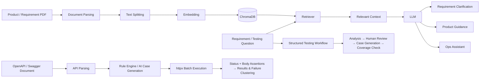
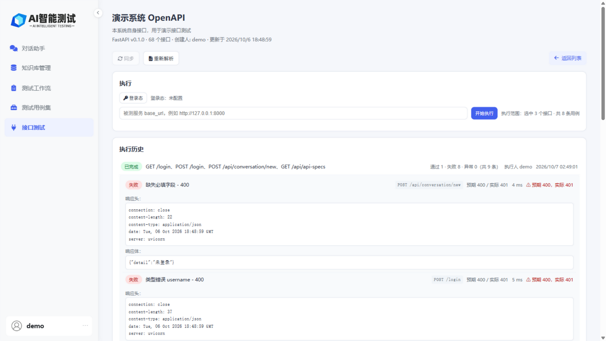

# AI Test Case Generation & Testing Assistant Platform

> An AI-powered testing assistant built with **RAG + LLM** to help software testers analyze requirements, identify test points, generate test cases, and retrieve product knowledge.
>
> **AI Test Case Generator · AI Testing · RAG · LLM · Software Testing**

[简体中文](README.md) | [English](README_EN.md)

[](https://github.com/ChiufungLee/AI-Test-Case-Generator/stargazers)
[](https://github.com/ChiufungLee/AI-Test-Case-Generator/network/members)
[](https://github.com/ChiufungLee/AI-Test-Case-Generator/issues)
[](LICENSE)

<!--
Recommended demo asset:
docs/images/demo.gif

Suggested flow:
Upload PDF → Select Knowledge Base → Requirement Clarification → Create Test Task → Human Review → Case Generation → Coverage Check → Export CSV

Uncomment the next line once the asset is ready:

-->

---

## 📌 Overview

AI Test Case Generation & Testing Assistant Platform is an open-source project for **software testing, test development, and AI-assisted QA**.

The application is built with **FastAPI + LangChain + LangGraph + RAG + ChromaDB + LLM**. It allows users to upload PDF product or requirement documents, build a searchable knowledge base, retrieve relevant context, and use a large language model for:

- Scenario-based chat: requirement clarification, product guidance, and ops assistance, grounded in knowledge-base retrieval
- A structured testing workflow: requirement analysis → human review → test case generation → coverage check (orchestrated by LangGraph, artifacts persisted per version)
- Test case sets: publish workflow cases as long-lived assets with manual editing, versioning, field-level diffs, rollback, and AI editing
- API testing: import OpenAPI → generate endpoint cases via rule engine/AI → batch execution → response assertions and failure clustering
- CSV export of generated test cases
- PDF upload, preview, and deletion
- Multi-user conversations and knowledge-base isolation

The project focuses on reducing repetitive work in requirement understanding, product knowledge retrieval, and test case design.

---

## ✨ Core Features

| Feature | Description |
| --- | --- |
| 📄 PDF Knowledge Base | Upload product and requirement PDFs; documents are parsed and embedded in the background to build a searchable knowledge base |
| 🔎 RAG Retrieval | Retrieve relevant document content and inject it as context; multi-turn follow-ups go through query rewrite, and history is trimmed by both message count and token budget |
| 💬 Scenario Chat | Three scenarios — Requirement Clarification / Product Guidance / Ops Assistant; with a knowledge base selected it runs RAG, without one it falls back to plain-chat prompts automatically |
| 📎 Chat Attachments | Attach a PDF while chatting: it is ingested into the knowledge base and included in retrieval for RAG conversations, or parsed directly as one-shot context for plain conversations |
| 🧩 Structured Testing Workflow | LangGraph orchestration: requirement analysis → human review → case generation → coverage check, with each stage persisted as versioned artifacts |
| 🖱️ Human-in-the-loop | The graph pauses after requirement analysis; edit the analysis before continuing. State is checkpointed to SQLite so runs survive disconnects |
| ✅ Coverage Check | No LLM involved: set operations over requirement references plus RapidFuzz similarity for duplicate detection, with transparent statistics |
| 🧰 Test Case Sets | Long-term test-case-set asset management: publish workflow cases as assets, with manual editing, append-only versioning, field-level diffs, one-click rollback, and private/shared visibility |
| 🤖 AI Case Editing | Edit published case sets with natural-language instructions: the AI returns a complete proposal, saved as an "AI edit" version only after you review the diff; case IDs are immutable and deletions are derived server-side |
| 🔌 API Testing | Import OpenAPI/Swagger (URL with sync / paste with re-parse) → deterministic Schema rule engine generates endpoint cases (normal / missing-required / type-error / out-of-range / invalid-enum / pattern-violation, with auto-derived response assertions) → AI business-anomaly suggestions (two-phase confirmation) → editable cases (request / expected status / response assertions) → multi-endpoint batch execution with failures clustered by "status × endpoint" → response-body field assertions (eq/exists/type) evaluated per item → login pre-request carries the session automatically (Cookie/Bearer) → SSE live results with three-way verdicts; run history includes the executor and response snapshots |
| 📚 Product Assistant | Answer product usage and troubleshooting questions from product documentation |
| 👤 Multi-user Isolation | Isolate conversations and knowledge bases by user |
| 👥 Shared Knowledge Bases | Knowledge bases can be private or shared; shared ones are readable by all logged-in users |
| ⚡ Streaming Response | Stream LLM output for a better interactive experience; supports the DeepSeek thinking-mode switch |
| 📤 Test Case Export | Export generated test cases as CSV (`utf-8-sig` with BOM, opens correctly in Excel) |

---

## 🔄 Current Workflow



---

## 🧩 Structured Testing Workflow (LangGraph)

Beyond scenario-based chat, the system ships a real testing workflow orchestrated by **LangGraph** (entry: "测试工作流" (Testing Workflow) in the sidebar or `/workflows`):

```text
START
  ↓
load_requirement            # Deterministic node: load requirement and KB config
  ↓
retrieve_knowledge          # Deterministic node: one RAG retrieval over the requirement text, persisted for review
  ↓
requirement_analysis_agent  # Agent node: structured requirement analysis (JSON)
  ↓
human_review                # interrupt: confirm / edit the analysis before continuing
  ↓
test_case_generation_agent  # Agent node: generate cases from the upstream analysis (no re-interpretation)
  ↓
coverage_check              # Deterministic node: requirement coverage / invalid refs / priorities / duplicates
  ↓
END
```

- **Artifacts as first-class objects**: analysis, case set and coverage report are persisted (`workflows` + `artifacts` tables), appended per version; human edits create a new version (`parent_artifact_id` links back), enabling "which analysis version produced these cases" traceability.
- **Human-in-the-loop**: the graph pauses at `human_review` via `interrupt`; the UI allows editing the analysis JSON before resuming. State is persisted by a SQLite checkpointer so runs survive disconnects.
- **Deterministic checks stay out of the LLM**: coverage is computed with set operations and character-similarity (RapidFuzz), avoiding noisy LLM self-grading; the report states its measurement criteria.
- **Dynamic case limit**: the number of generated cases is computed from the number of requirement points (`clamp(points × 3, 10, 40)`), so small requirements are not flooded and large ones are not truncated.

---

## 🖼️ Screenshots

| Requirement Clarification (RAG retrieval with source citations) | Testing Workflow (human review of the analysis) |
| --- | --- |
|  |  |

| Test Case Generation (one-click CSV export) | Coverage Report |
| --- | --- |
|  |  |

| Knowledge Base Management | Chat Attachments (one-shot PDF analysis in plain chat) |
| --- | --- |
|  |  |

| API Testing (batch selection & grouped case editing) | Run Results & Failure Diagnostics (headers / body) |
| --- | --- |
|  |  |

| Test Case Sets (case-set assets) | Case-Set Detail (edit / versions / rollback) | Field-Level Version Diff |
| --- | --- | --- |
|  |  |  |

---

## 🔍 Keywords

English: AI Testing · AI Test Case Generation · Software Testing · Test Automation · API Testing · RAG

中文：AI 测试 · AI 测试用例生成 · 需求分析 · 软件测试 · 测试提效

---

## 🧰 Technology Stack

### Backend

- Python 3.11+ (3.12 recommended)
- FastAPI
- SQLAlchemy

### AI / RAG

- LangChain
- LangGraph
- ChromaDB
- Retrieval-Augmented Generation (RAG)
- Large Language Model (LLM)
- Embeddings

### Frontend

- HTML
- JavaScript

### Database

- MySQL
- SQLite for test environments

---

## 🤖 Model Configuration

LLM and embedding settings are configured independently through `LLM_*` and `EMBEDDING_*` environment variables.

The current repository example uses:

- **LLM**: DeepSeek `deepseek-v4-flash`
- **Embedding**: Alibaba Cloud DashScope `text-embedding-v4`

> The embedding model and vector dimensions used during ingestion must remain compatible with those used during retrieval. If `EMBEDDING_MODEL` or `EMBEDDING_DIMENSIONS` changes, evaluate the impact and rebuild the existing Chroma collection when necessary.

LLM and embedding credentials, endpoints, and model parameters are kept separate.

> DeepSeek thinking mode is disabled by default (`LLM_ENABLE_THINKING=false`) for faster responses and effective temperature; when enabled, reasoning tokens count against `max_tokens` and temperature has no effect, so `LLM_MAX_TOKENS` / `WORKFLOW_LLM_MAX_TOKENS` may need to be raised accordingly.

---

## 🚀 Run Locally

### Requirements

Prepare:

- Python 3.11+ (3.12 recommended; the LangGraph human-review node does not run on 3.10)
- MySQL or SQLite
- An accessible LLM API
- An accessible Embedding API

### 1. Clone

```bash
git clone https://github.com/ChiufungLee/AI-Test-Case-Generator.git
cd AI-Test-Case-Generator
```

### 2. Install Dependencies

```bash
pip install -r requirements.txt
```

### 3. Configure Environment Variables

Copy `.env.example` from the project root to `.env` and adjust as needed. Key settings:

```env
# Application
APP_ENV=development
SESSION_SECRET_KEY=dev-session-secret-change-me

# Database (DATABASE_URL takes precedence when set, e.g. sqlite:///./fast_test.db;
# when empty, the connection string is built from the MySQL settings)
# DATABASE_URL=
MYSQL_USER=root
MYSQL_PASSWORD=your_password
MYSQL_HOST=localhost
MYSQL_PORT=3306
MYSQL_DATABASE=aitest_rag

# LLM (DeepSeek)
LLM_PROVIDER=deepseek
LLM_MODEL=deepseek-v4-flash
LLM_API_KEY=your_llm_api_key
LLM_BASE_URL=https://api.deepseek.com
LLM_TEMPERATURE=0.7
LLM_MAX_TOKENS=16384
LLM_ENABLE_THINKING=false

# Embedding (Alibaba Cloud DashScope compatible endpoint)
EMBEDDING_PROVIDER=openai
EMBEDDING_MODEL=text-embedding-v4
EMBEDDING_API_KEY=your_embedding_api_key
EMBEDDING_BASE_URL=https://dashscope.aliyuncs.com/compatible-mode/v1
EMBEDDING_DIMENSIONS=1024
EMBEDDING_ENCODING_FORMAT=float

# Retrieval
RETRIEVER_TOP_K=5
RETRIEVER_CANDIDATE_K=10
CHROMA_DISTANCE_METRIC=cosine

# Workflow
WORKFLOW_LLM_MAX_TOKENS=16384
WORKFLOW_CHECKPOINT_DB_PATH=./data/langgraph_checkpoints.db

# Storage
RAG_DB_PATH=./chroma_db
UPLOAD_DIR=./uploads
TEMP_UPLOAD_DIR=./temp_uploads
```

### Configuration Notes

- See [.env.example](.env.example) for the full list of settings and their defaults.
- In development, if `DATABASE_URL` is not set, the application falls back to a connection string built from the MySQL settings.
- In production, `SESSION_SECRET_KEY` must be explicitly configured, and the database must not use default credentials.
- `LLM_MAX_TOKENS` controls the maximum LLM output tokens; `LLM_TIMEOUT_*` values are in seconds; `LLM_MAX_RETRIES` controls the number of LLM request retries.
- `LLM_ENABLE_THINKING=false` (default) is non-thinking mode; when `true`, reasoning tokens count against `max_tokens` and temperature has no effect.
- `EMBEDDING_DIMENSIONS` must match the vector dimension of existing Chroma collections.
- `CHROMA_DISTANCE_METRIC` (cosine / l2) only takes effect when a collection is created; it does not affect existing collections.
- Distance filtering is enabled only when `RETRIEVER_ENABLE_DISTANCE_FILTER=true` and `RETRIEVER_DISTANCE_THRESHOLD` is configured; the threshold meaning depends on the collection metric.
- `WORKFLOW_LLM_MAX_TOKENS` caps the workflow structured output and must fit the complete case-set JSON.

### 4. Start the application

Development (auto-reload):

```bash
uvicorn main:app --host 0.0.0.0 --port 8000 --reload
```

Production:

```bash
APP_ENV=production uvicorn main:app --host 0.0.0.0 --port 8000 --workers 1
```

Production notes:

- **Single worker is mandatory**: run mutual exclusion, SSE event buffering/subscription replay, the retriever cache, and the LLM/httpx clients are all in-process state. With multiple workers or replicas the same task can run once per process and SSE subscription/resume breaks; to scale horizontally, externalize the run hub first (e.g. Redis pub/sub).
- With `APP_ENV=production` the app requires `SESSION_SECRET_KEY`, rejects the default database password, and marks session cookies `https_only`; deploy behind an HTTPS reverse proxy (which must forward `X-Forwarded-Proto`).
- Persist and back up `RAG_DB_PATH` (Chroma), `WORKFLOW_CHECKPOINT_DB_PATH` (workflow checkpoints) and `UPLOAD_DIR`; deleting the vector store makes knowledge bases unsearchable.
- At startup the app performs two idempotent maintenance steps: resetting document rows stuck in pending/processing to failed, and scrubbing plaintext credentials from historical API-test result snapshots (one-off).

### 5. Open the Application

- Chat: `http://localhost:8000/chat`
- Testing Workflow: `http://localhost:8000/workflows`
- Test Case Sets: `http://localhost:8000/testbench`
- API Testing: `http://localhost:8000/api-test`
- Knowledge Base: `http://localhost:8000/knowledge`
- Swagger UI: `http://localhost:8000/docs`
- ReDoc: `http://localhost:8000/redoc`

---

## 🧪 Testing

The project uses pytest for automated tests (312 tests currently passing), covering authentication and authorization isolation, knowledge-base file flows, chat attachments, RAG retrieval authorization, workflow state transitions and artifact versioning, SSE event streams, test-case-set asset publishing/editing/versioning/rollback/AI editing, OpenAPI parsing (including Swagger 2.0 form normalization and URL-import sync/re-parse), API case generation with response assertions, and the execution pipeline (stubbed with httpx MockTransport).

Run all tests:

```bash
pytest
```

Run a single test file or case:

```bash
pytest tests/test_auth.py
pytest tests/test_chat_attachment.py
pytest tests/test_chat_authorization.py -k "test_user_cannot_read"
```

> Tests run against a temporary SQLite database and stub out external dependencies (LLM, embedding, and ChromaDB), so no real API keys are required. CI integration will be added in a future release.

---

## 🔌 Main Routes

### Page Routes

```text
/login
/register
/chat
/knowledge
/knowledge-detail?kb_id=...
/workflows
/testbench
/testbench-detail?set_id=...
/api-test
```

### Main APIs

```text
/api/chat                    # SSE streaming chat
/api/history
/api/conversation/...
/api/export/testcases        # CSV export from chat
/api/knowledge-bases/...     # knowledge bases and files (upload / preview / parsing)
/api/workflows/...           # test tasks: create / run events (SSE) / human review / CSV export
/api/test-sets/...           # test case sets: publish / edit / versions / diff / rollback / AI editing / export
/api/api-specs/...           # API testing: URL/paste import, sync, re-parse, login pre-request, endpoints and cases (rule engine + AI + editing)
/api/api-specs/{id}/runs     # run execution (SSE live events)
/api/test-runs/{run_id}      # run details and per-case results (assertion details and response snapshots)
/logout
```

Explore the full API through Swagger:

```text
http://localhost:8000/docs
```

---

## 📁 Project Structure

```text
AI-Test-Case-Generator/
├── api/
│   └── endpoints/
├── docs/               # design decision records (docs/decisions.md)
├── models/
├── prompts/
├── schemas/
├── services/
├── static/
├── templates/
├── tests/
├── utils/
├── workflows/          # LangGraph workflow orchestration (state / nodes / graph)
├── config.py
├── main.py
├── .env.example
├── requirements.txt
└── README.md
```

---

## 🧩 Current Features & Roadmap

### Implemented

- [x] PDF Knowledge Base
- [x] RAG Retrieval (multi-turn query rewrite, history trimming)
- [x] Scenario Chat (Requirement Clarification / Product Guidance / Ops Assistant)
- [x] Chat Attachments (knowledge-base ingest / one-shot plain-chat analysis)
- [x] Structured Requirement Analysis
- [x] Testing Workflow (analysis → human review → case generation → coverage check)
- [x] Test Case Sets (case-set assets: publish / manual editing / versioning / diff / rollback / sharing)
- [x] AI Case Editing (instruction → structured proposal → diff review → versioned save)
- [x] API Testing (OpenAPI import / sync / re-parse → rule engine + AI generation → batch execution with failure clustering → response-body assertions → live SSE results and run history)
- [x] Human Review / Analysis Editing
- [x] Test Case Artifacts and Versioning
- [x] Deterministic Coverage Check
- [x] User Conversations
- [x] Knowledge Base Isolation
- [x] Shared Knowledge Bases
- [x] Streaming Responses
- [x] CSV Test Case Export

### Roadmap

#### v0.2 — Retrieval Quality

- [ ] RAG Retrieval Evaluation

#### v0.3 — Test Automation

- [x] OpenAPI / Swagger Import
- [x] API Test Case Generation
- [x] Automated Test Execution
- [x] Persistent Test Results
- [ ] Pytest Script Generation

#### v0.4 — AI Quality Engineering

- [ ] AI Test Result Analysis (the data structures — failure clustering and assertion details — are already reserved)
- [ ] Defect Analysis Assistance
- [ ] Regression Evaluation
- [ ] Quality Gates
- [ ] AI / LLM Output Evaluation

#### Long-term Direction

```text
Requirement
    ↓
Requirement Analysis
    ↓
Risk Analysis
    ↓
Test Design
    ↓
Test Case Set
    ↓
Automation Script
    ↓
Test Execution
    ↓
Test Result
    ↓
AI Result Analysis
    ↓
Quality Evaluation / Quality Gate
```

---

## 🧠 Why RAG?

A general-purpose LLM may not know the business rules, product constraints, or project-specific terminology required for high-quality test design.

This project uses RAG to bring product knowledge into the model context, so that generated test content is grounded in project-specific knowledge instead of relying only on the model's general knowledge.

---

## 🤝 Contributing

Contributions are welcome, including:

- Bug reports
- Feature requests
- Pull requests
- New testing scenarios
- RAG improvements
- Prompt improvements

For pull requests, please describe the problem, the proposed change, and how the change was validated.

---

## 📄 License

This project is released under the [MIT License](LICENSE).
